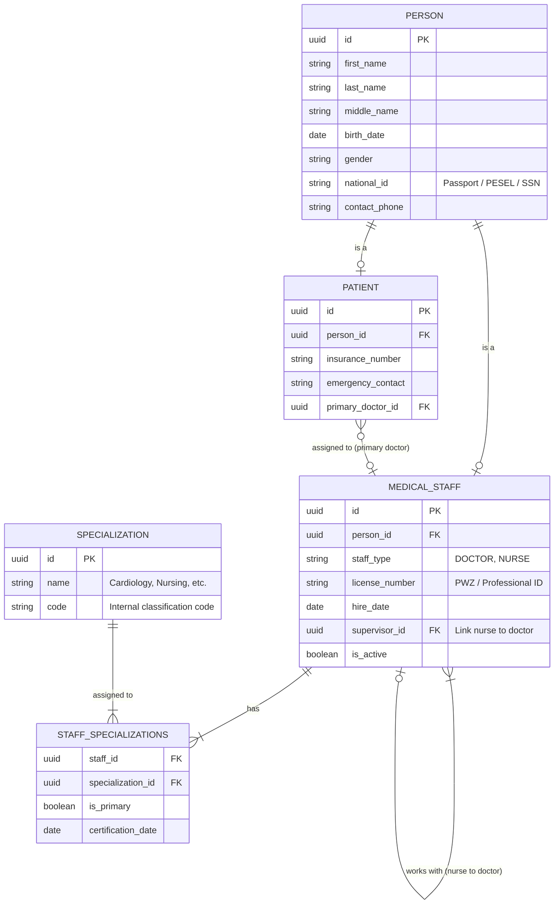

```mermaid
erDiagram
    PERSON ||--o| PATIENT : "is a"
    PERSON ||--o| MEDICAL_STAFF : "is a"
    
    MEDICAL_STAFF }|--o| MEDICAL_STAFF : "works with (nurse to doctor)"
    
    MEDICAL_STAFF ||--|{ STAFF_SPECIALIZATIONS : "has"
    SPECIALIZATION ||--|{ STAFF_SPECIALIZATIONS : "assigned to"
    
    PATIENT }o--o| MEDICAL_STAFF : "assigned to (primary doctor)"

    PERSON {
        uuid id PK
        string first_name
        string last_name
        string middle_name
        date birth_date
        string gender
        string national_id "Passport / PESEL / SSN"
        string contact_phone
    }

    PATIENT {
        uuid id PK
        uuid person_id FK
        string insurance_number
        string emergency_contact
        uuid primary_doctor_id FK
    }

    MEDICAL_STAFF {
        uuid id PK
        uuid person_id FK
        string staff_type "DOCTOR, NURSE"
        string license_number "PWZ / Professional ID"
        date hire_date
        uuid supervisor_id FK "Link nurse to doctor"
        boolean is_active
    }

    SPECIALIZATION {
        uuid id PK
        string name "Cardiology, Nursing, etc."
        string code "Internal classification code"
    }

    STAFF_SPECIALIZATIONS {
        uuid staff_id FK
        uuid specialization_id FK
        boolean is_primary
        date certification_date
    }
```